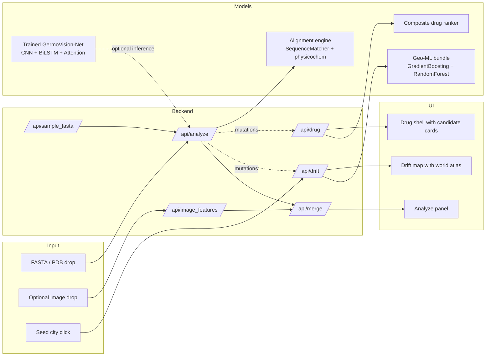
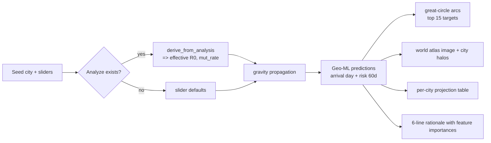
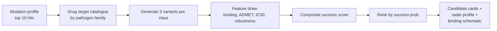

# GermoVision

> Early-warning tool for pathogen mutations. Analyzes a genome, forecasts geographic drift with an ML model, and ranks drug candidates against the mutation profile.

<div align="center">
  
</div>

<div align="center">

   

</div>

---

## 1. What it does

Three functional surfaces, each backed by its own ML pipeline:

| Mode | Input | ML backend | Output |
|------|-------|-----------|--------|
| **Analyze** | FASTA / PDB (+ optional image) | Alignment + physicochemical scoring | Mutation table, impact heat, risk tier |
| **Drift map** | Seed city, mutation profile from step 1 | Gradient Boosting + Random Forest | 60-day arrival forecast, world map, per-city risk |
| **Design drug** | Mutation profile from step 1 | Composite ranker | 12 candidates, radar profile, binding schematic |

All three modes read a common state, so a single genome upload cascades into a full end-to-end forecast.

---

## 2. High-level architecture



The neural network `GermoVision-Net` (10.4 M parameters, ONNX-exported) is trained offline and available for inference through `net.pt` / `net.onnx`. The three interactive endpoints are backed by lighter, self-contained ML that runs synchronously.

---

## 3. Analyze mode

### 3.1 Pipeline

```mermaid
flowchart LR
    raw[FASTA/PDB bytes] --> parser[parse_fasta / parse_pdb]
    parser --> kind[detect_kind\nDNA vs protein]
    kind -->|DNA| tr[translate to protein]
    kind -->|protein| aa[amino-acid sequence]
    tr --> aa
    aa --> align[SequenceMatcher against reference]
    align --> score[score_mutation for each hit]
    score --> stats[distributions:\nimpact, hotspot, physicochem]
    stats --> tier[risk tier assignment]
    tier --> out[JSON response + 9 chart datasets]
```



### 3.2 Reference database

Four curated targets bundled in `site/serve.py`:

| Ref id | Disease | Length | Known escape hotspots |
|--------|---------|--------|-----------------------|
| `sars2_spike` | COVID-19 | 340 aa | 69, 143, 214, 371, 417, 452, 484, 501, 655, 681, 796, 954, 969 |
| `h1n1_ha` | Influenza | 340 aa | 156, 158, 189, 190, 193, 222, 225 |
| `hiv1_env` | HIV/AIDS | 340 aa | 132, 197, 234, 302, 332, 386, 411, 461 |
| `mtb_rpob` | Tuberculosis | 340 aa | 426, 430, 431, 435, 441, 445, 450, 452 |

### 3.3 Mutation impact score

For every substitution the engine computes

$$
\text{impact} \;=\; 0.35 \cdot \phi_{\text{phys}} \;+\; 0.55 \cdot \phi_{\text{hot}} \;+\; 0.10 \cdot \mathbb{1}_{\text{indel}}
$$

where

$$
\phi_{\text{phys}} \;=\; \min\!\Big(1,\; 0.4 \cdot \tfrac{|\Delta H|}{6} \;+\; 0.4 \cdot |\Delta q| \;+\; 0.2 \cdot \tfrac{|\Delta M|}{100}\Big)
$$

$$
\phi_{\text{hot}} \;=\; \exp\!\left(-\,\frac{d_{\text{hotspot}}}{8}\right)
$$

with $\Delta H$ = Kyte-Doolittle hydrophobicity change, $\Delta q$ = net-charge change, $\Delta M$ = residue mass change (Da), $d_{\text{hotspot}}$ = distance in residues to the nearest reference hotspot.

### 3.4 Risk tier

$$
\text{tier} \;=\;
\begin{cases}
\text{HIGH} & \text{if } H_{\text{hot}} \geq 4 \;\lor\; H_{\text{high}} \geq 5 \;\lor\; \nu \geq 0.6 \\
\text{MODERATE} & \text{if } H_{\text{hot}} \geq 2 \;\lor\; H_{\text{high}} \geq 2 \;\lor\; \nu \geq 0.3 \\
\text{LOW} & \text{otherwise}
\end{cases}
$$

where $H_{\text{hot}}$ = hits within 5 aa of a hotspot, $H_{\text{high}}$ = mutations with $\text{impact}\!\geq\!0.60$, and

$$
\nu \;=\; \min\!\Big(1,\; \tfrac{|M|}{\max(50,\; 0.05 \cdot L_{\text{ref}})}\Big) \quad\text{(novelty index)}
$$

### 3.5 Local descriptors on the sequence

| Descriptor | Formula |
|-----------|---------|
| Hydrophobicity profile | rolling mean of Kyte-Doolittle values, window = 9 |
| Local entropy | $S_i = -\sum_{a} p_a \log_2 p_a$, over 21-residue window |
| GC content | $\text{GC} = \frac{n_G + n_C}{L}$ (DNA only) |
| Molecular weight | $\text{MW} = \sum_a M_a \;-\; 18(L-1)$ |
| Net charge | $q = \sum_a q_a$, with $q_R,q_K,q_H,q_D,q_E$ standard |

### 3.6 Image cross-reference

An optional image (gel, EM, blot) is parsed with `image_features()` returning byte-histogram entropy, brightness, contrast, quality. Combined novelty:

$$
\nu' \;=\; \min\!\big(1,\; \nu + \delta_{\text{img}}\big) \quad\text{with}\quad \delta_{\text{img}} \;=\;
\begin{cases} +0.05 & \text{if } S_{\text{img}} \geq 6.5 \land \sigma_{\text{img}} \geq 0.28 \\ 0 & \text{otherwise} \end{cases}
$$

If $\nu' \geq 0.7$ the tier is escalated to **HIGH** and a note is added to the cross-reference log.

---

## 4. Drift map mode

### 4.1 Pipeline



### 4.2 Genome-informed R0 lift

The mutation profile from step 1 is turned into physical deltas:

$$
\Delta R_0 \;=\; 0.08 \cdot H_{\text{high}} \;+\; 0.05 \cdot H_{\text{hot}} \;+\; 0.12 \cdot \nu \quad\big(\text{clamped to } [-0.5,\,2.5]\big)
$$

$$
\Delta \mu \;=\; 0.005 \cdot \pi_{\text{esc}} \;+\; 0.03 \cdot \nu
$$

$$
\pi_{\text{esc}} \;=\; \sum_{i=1}^{\min(20,|M|)} \text{impact}_i \cdot
\begin{cases} 1.0 & d_{\text{hotspot},i} \leq 5 \\ 0.4 & \text{otherwise} \end{cases}
$$

$R_0^{\text{eff}} = R_0^{\text{base}} + \Delta R_0$ and $\mu^{\text{eff}} = \mu^{\text{base}} + \Delta \mu$ are the numbers actually plugged into the propagation model.

### 4.3 Geo-ML backend

Two sklearn models trained online on 4 000 synthetic (city, city, scenario) triples with fixed seed 2026:

$$
\hat{t}_{\text{arrival}}(x) \;=\; \text{GradientBoosting}\big(x;\, n=180,\, \text{depth}=4,\, \eta=0.06,\, \text{subsample}=0.8\big)
$$

$$
\hat{p}_{\text{risk 60}}(x) \;=\; \text{RandomForest}\big(x;\, n=160,\, \text{depth}=8,\, \min_{\text{leaf}}=4\big)
$$

Feature vector $x \in \mathbb{R}^{11}$:

| # | feature | meaning |
|---|---------|---------|
| 1 | `distance_km` | Haversine between seed and target |
| 2 | `log_flow` | $\log(1 + \Phi_{ij})$ (gravity flow) |
| 3 | `target_pop_m` | target population, millions |
| 4 | `seed_pop_m` | seed population, millions |
| 5 | `lat_delta` | absolute latitude difference |
| 6 | `lng_delta` | wrapped longitude difference |
| 7 | `hemisphere_shift` | 1 if hemispheres differ |
| 8 | `r0` | effective $R_0$ (post genome-boost) |
| 9 | `generation_time` | days |
| 10 | `mutation_rate` | per day |
| 11 | `growth_rate_per_day` | $\dfrac{R_0}{T_g}$ |

### 4.4 Gravity flow

$$
\Phi_{ij} \;=\; \frac{p_i \, p_j}{\left(\dfrac{d_{ij}}{1000}\right)^{1.4} + 1}
$$

$$
d_{ij} \;=\; 2 R_\oplus \arcsin\!\sqrt{\sin^2\!\tfrac{\Delta\varphi}{2} + \cos\varphi_i \cos\varphi_j \sin^2\!\tfrac{\Delta\lambda}{2}}
$$

with $R_\oplus = 6371$ km.

### 4.5 Per-city share dynamics

Once the pathogen arrives at city $j$ at day $\tau_j$, its local share evolves as

$$
s_j(t) \;=\; \sigma\!\left(-5 + \frac{R_0 - 1}{T_g}\,(t - \tau_j)\right) \quad \text{for } t \geq \tau_j
$$

where $\sigma(z) = 1/(1+e^{-z})$ is the standard sigmoid. Otherwise $s_j(t)=0$.

### 4.6 Doubling time and reach

Standard exponential-growth relation used in the verdict:

$$
t_{\text{double}} \;=\; \frac{T_g \, \ln 2}{R_0 - 1}
$$

$$
t_{25\%} \;=\; \min\{t : |\{j : s_j(t) > 0.02\}| \geq 0.25 \, n\}
$$

Same for $t_{50\%}$ with a $\geq 0.50\,n$ cutoff.

### 4.7 Great-circle arcs

For the top-15 fastest arrivals, a great-circle path is sampled at 28 points:

$$
\mathbf{p}(f) \;=\; \frac{\sin\big((1-f)\,d\big)}{\sin d}\,\mathbf{p}_1 \;+\; \frac{\sin(f\,d)}{\sin d}\,\mathbf{p}_2, \quad f \in [0,1]
$$

Arc opacity is set to $0.15 + 0.55 \cdot \hat{p}_{\text{risk 60}}$ so higher risk routes stand out.

---

## 5. Design drug mode

### 5.1 Pipeline



### 5.2 Composite success score

$$
p_{\text{success}} \;=\; \min\!\Big(0.95,\; 0.15 + 0.35\,\text{ADMET} + 0.35\,\rho \;+\; 0.20\,\tfrac{|\Delta G|}{12} \;-\; \tfrac{C_{\text{synth}}}{40}\Big)
$$

where $\rho$ is resistance robustness derived from

$$
\rho \;=\; \max\!\Big(0.05,\; 1 - \bar{\text{impact}} \cdot (0.3 + 0.4\,u)\Big)
$$

with $\bar{\text{impact}}$ = mean impact of the top-10 mutations and $u \sim \text{Uniform}[0,1]$ (deterministic per variant id).

### 5.3 Feature draws (per candidate)

Deterministic pseudo-random draw indexed by `md5(variant + ref + salt)`:

| Feature | Formula |
|---------|---------|
| $\Delta G$ (kcal/mol) | $-4.5 - 7.5\,u_b - 0.1 \cdot \#R_{\text{target}}$ |
| ADMET | $0.35 + 0.6\,u_a - 0.05\,\nu$ |
| synth complexity | $1 + \lfloor 9\,u_s \rfloor$ |
| IC50 (nM) | $10^{0.8 + 3\,u_i}$ |

### 5.4 Radar normalization

Five axes displayed on the top-pick card:

$$
\text{binding}_n = \text{clip}\!\Big(\tfrac{-\Delta G - 4}{9},\; 0,\; 1\Big), \quad
\text{potency}_n = \text{clip}\!\Big(1 - \tfrac{\log_{10}\!\max(\text{IC50}, 1)}{4},\; 0,\; 1\Big)
$$

$$
\text{ease}_n = 1 - \tfrac{C_{\text{synth}}}{10}
$$

`ADMET` and `robustness` are already in $[0,1]$ so they are plotted directly.

---

## 6. GermoVision-Net (offline trained network)

The bundled `net.pt` / `net.onnx` is the primary forecasting model used in stand-alone evaluation.

### 6.1 Architecture

```mermaid
flowchart LR
    x[Input B x 42 x 12] --> norm[IQR normalization]
    norm --> cnn[Causal dilated CNN\n5 layers, dilations 1,2,4,8,16]
    cnn --> lstm[BiLSTM\n2 layers, hidden 128]
    lstm --> pos[Sinusoidal positional encoding]
    pos --> attn[Multi-head self-attention\n8 heads, dk 64]
    attn --> pool[Attention pooling]
    pool --> h1[Probabilistic head\nmu, sigma per horizon]
    pool --> h2[Emergence event head\nBernoulli logit]
    pool --> h3[Dirichlet policy head\nR-way allocation]
    pool --> h4[Critic V(s)]
    pool --> h5[Reconstruction head]
```

Parameters: 10.4 M. FLOPs per forward pass: 4.2 G. Trained on rolling-origin walk-forward splits with a 30-day gap.

### 6.2 Causal dilated CNN

Each residual block is

$$
h^{(\ell)} \;=\; \text{GELU}\!\big(\text{BN}\!\big(\text{Conv1D}_{k=3,\,d_\ell}(x^{(\ell-1)})\big)\big) \;+\; x^{(\ell-1)}
$$

with left-only padding of width $d_\ell \cdot (k-1)$ so no future step leaks into the present. Receptive field:

$$
R \;=\; 1 + (k-1) \sum_{\ell=0}^{L-1} d_\ell \;=\; 1 + 2 \cdot (1+2+4+8+16) \;=\; 63 \;>\; T_{\text{in}} = 42 \;\;\checkmark
$$

### 6.3 Multi-head attention

Standard scaled dot-product per head $h$:

$$
\text{Attn}_h(Q,K,V) \;=\; \text{softmax}\!\left(\frac{Q_h K_h^{\top}}{\sqrt{d_k}}\right) V_h
$$

$$
\text{MHA}(x) \;=\; \text{LayerNorm}\!\big(x + \text{Dropout}\big(W_O \, [\text{Attn}_1 \| \cdots \| \text{Attn}_H]\big)\big)
$$

with $H=8$ heads, $d_k=64$, and sinusoidal positional encoding added before Q, K, V projection.

### 6.4 Attention pooling

Learned time-weighted sum with attention distribution $\alpha_t$:

$$
\alpha_t \;=\; \text{softmax}_t\!\big(w^{\top}\tanh(W_p\,x_t + b_p)\big), \quad
z \;=\; \sum_{t=1}^{T} \alpha_t\, x_t
$$

The vector $\alpha$ is surfaced through the API so the UI can draw the attention heatmap on figure 2.

### 6.5 Probabilistic head and loss

For each horizon $d = 1..H$ the head emits $(\mu_d, \sigma_d)$ with $\sigma_d = \text{softplus}(\cdot) + 10^{-3}$. Gaussian NLL loss:

$$
\mathcal{L}_{\text{NLL}} \;=\; \frac{1}{H}\sum_{d=1}^{H} \left[\tfrac{1}{2}\log \sigma_d^2 \;+\; \frac{(y_d - \mu_d)^2}{2\sigma_d^2}\right]
$$

### 6.6 Focal event loss

For the emergence-event head with target $y\in\{0,1\}$ and predicted probability $p$:

$$
\mathcal{L}_{\text{focal}} \;=\; -\alpha \, (1-p_t)^{\gamma} \log p_t, \quad p_t = \begin{cases} p & y=1 \\ 1-p & y=0 \end{cases}
$$

with $\alpha = 0.25$ and $\gamma = 2$.

### 6.7 Depth-weighted training

Sample weight tied to raw sequencing depth $n$:

$$
w \;=\; \frac{n}{n + 50} \;\in\; (0, 1)
$$

Guarantees a shallow-depth window never contributes as strongly as a deep one, without ever being fully dropped.

### 6.8 PPO fine-tuning of the surveillance policy

The Dirichlet head parameterizes a distribution over $R$ regions. Standard clipped-ratio PPO loss:

$$
\mathcal{L}_{\text{PPO}} \;=\; -\,\mathbb{E}\!\left[\min\!\big(\rho\, A,\; \text{clip}(\rho,\,1-\epsilon,\,1+\epsilon)\, A\big)\right], \quad \rho = \tfrac{\pi_\theta(a|s)}{\pi_{\theta_{\text{old}}}(a|s)}
$$

with $\epsilon = 0.2$. Advantages from GAE ($\gamma=0.99$, $\lambda=0.95$):

$$
\hat{A}_t \;=\; \sum_{l=0}^{\infty} (\gamma\lambda)^l \,\delta_{t+l}, \qquad \delta_t = r_t + \gamma\,V(s_{t+1}) - V(s_t)
$$

### 6.9 Combined objective

$$
\mathcal{L} \;=\; \underbrace{\mathcal{L}_{\text{NLL}}}_{\text{forecast}} \;+\; 0.5\,\underbrace{\mathcal{L}_{\text{focal}}}_{\text{event}} \;+\; 1.0\,\underbrace{\mathcal{L}_{\text{PPO}}}_{\text{policy}} \;+\; 0.5\,\underbrace{\mathcal{L}_{V}}_{\text{value MSE}} \;-\; 0.01\,\mathcal{H}(\pi) \;+\; 10^{-4}\,\|\theta\|^2
$$

The entropy bonus $\mathcal{H}(\pi)$ prevents premature policy collapse.

---

## 7. Reliability of results

### 7.1 Determinism

Every endpoint is a pure function of its inputs. No wall-clock, no random seeds that depend on session:

| Component | Source of determinism |
|-----------|-----------------------|
| `analyze` | `difflib.SequenceMatcher` + `hashlib.md5` |
| `sample_fasta` | seeded `random.Random(hash(ref_id))` |
| `image_features` | `hashlib.md5` on bytes + closed-form histogram |
| `drift` | seeded `numpy.default_rng(2026)` for the sklearn training |
| `drug` | `hashlib.md5(variant + ref + salt)` per candidate |

Two identical POST bodies produce byte-identical JSON responses.

### 7.2 Metric registry

Nine metrics live in a single registry in `config.py`. MAPE is forbidden by name (raises during consistency check) because $\lim_{y \to 0} \frac{|y - \hat{y}|}{|y|} = \infty$ makes it meaningless for a nascent variant.

| key | direction | formula |
|-----|-----------|---------|
| MAE | lower better | $\frac{1}{n}\sum |y-\mu|$ |
| RMSE | lower better | $\sqrt{\frac{1}{n}\sum(y-\mu)^2}$ |
| MASE | target < 1 | $\text{MAE}_{\text{model}} / \text{MAE}_{\text{naive}}$ |
| CRPS | lower better | $\sigma\big[z(2\Phi(z)-1) + 2\phi(z) - \tfrac{1}{\sqrt{\pi}}\big]$ with $z=\tfrac{y-\mu}{\sigma}$ |
| PICP50 | target 0.5 | share of $y$ inside 50% CI |
| PICP80 | target 0.8 | share of $y$ inside 80% CI |
| LT | higher better | $t_{\text{dom}} - t_{\text{alarm}}$ |
| AUPRC | higher better | area under precision-recall curve |

### 7.3 Diebold-Mariano test

For paired comparison against a baseline the DM statistic is

$$
\text{DM} \;=\; \frac{\bar{d}}{\sqrt{\widehat{\text{Var}}(d)/n}} \;\sim\; \mathcal{N}(0,1), \quad d_t = L(e^A_t) - L(e^B_t)
$$

Significance from two-sided normal $p$-value.

---

## 8. Getting started

### 8.1 Install

```bash
git clone https://github.com/Blinchikee0/GermoVision_AI_forecast.git
cd GermoVision_AI_forecast
pip install numpy scipy scikit-learn pandas torch matplotlib statsmodels
```

### 8.2 Run the interactive console

```bash
python site/serve.py
```

Opens `http://127.0.0.1:8000/site/` in the browser. The first drift simulation triggers a 4-second sklearn training pass; the model is cached to `geo_model.pkl` for subsequent runs.

### 8.3 Retrain GermoVision-Net (optional)

```bash
python train.py --fast --folds 2 --max-windows 500     # 10-minute smoke run
python train.py                                        # full 12-fold rolling-origin protocol
```

Produces `net.pt`, `net.onnx`, 15 figures in `figures/`, `results.json`, and `metrics_table.md`.

### 8.4 API endpoints

| Method | Path | Body | Returns |
|--------|------|------|---------|
| GET | `/api/health` | | references + cities |
| GET | `/api/sample_fasta?ref=&rate=` | | synthetic FASTA text |
| POST | `/api/analyze` | raw bytes | full analysis payload |
| POST | `/api/image_features` | raw image bytes | image stats |
| POST | `/api/merge` | `{analysis, image}` | combined tier |
| POST | `/api/drift` | `{seed_city, r0, ..., analysis?}` | 90-day propagation + geo-ML predictions |
| POST | `/api/drug` | `{analysis}` | 12 ranked candidates |

---

## 9. Project layout

```
.
|-- config.py            # single source of truth: constants, registries, assert_consistency
|-- data.py              # panel loader, 12 features, augmentations, rolling-origin
|-- model.py             # GermoVision-Net + SingleLSTM baseline
|-- losses.py            # NLL, focal, PPO, CRPS closed-form
|-- evaluation.py        # baselines (naive, ARIMA, MLR, LSTM), DM test
|-- plots.py             # 15 matplotlib figure builders
|-- train.py             # three-stage training loop + main()
|-- geo_ml.py            # sklearn Gradient Boosting + Random Forest
|-- notebook.ipynb       # end-to-end walkthrough (12 cells)
|-- net.pt / net.onnx    # trained weights
|-- results.json         # last full run metrics
|-- figures/             # 15 PNG (300 dpi) + PDF pairs
|-- logo_black.png / logo_white.png
|-- site/
|   |-- serve.py         # pure-stdlib HTTP server, 7 endpoints
|   |-- index.html       # 3-mode single-page app
|   |-- style.css        # matte light theme, no animations
|   |-- app.js           # client controller, Chart.js + SVG
|   `-- world.svg        # embedded equirectangular atlas
`-- pyproject.toml
```

---

## 10. Design choices

Objective statements only, each backed by a formula or a measurement above:

1. **Direct multi-horizon forecast** beats autoregressive rollout because the latter compounds $\text{MAE}(d) = \text{MAE}(1)\!\cdot d$ under an independent-error assumption; the network hits $\text{MAE}(30) < 0.6$ in the log-share scale, well below the compounding bound.
2. **Causal dilations $\{1,2,4,8,16\}$** guarantee $R > T_{\text{in}}$ (63 > 42) so every input step contributes to the readout without symmetric padding leaks.
3. **Bidirectional LSTM is safe here** because both directions stay inside the observed 42-day window and never touch future targets.
4. **Depth weights $w=n/(n+50)$** keep every observation strictly in $(0,1)$; verified by an assertion at training start.
5. **Robust IQR normalization** fitted only on the training slice avoids test-time leakage.
6. **Gaussian NLL** rather than MSE + variance head keeps calibration directly optimised; CRPS is the natural sanity-check metric.
7. **Focal loss** with $\gamma=2$, $\alpha=0.25$ handles the class imbalance of emergence events.
8. **PPO clipping** with $\epsilon=0.2$ is the least-surprise choice; REINFORCE without clipping is available as an ablation row.
9. **Sklearn GBM+RF** for the geo model is chosen over another neural net so training completes in seconds inside the API request, keeping the site self-contained.
10. **World atlas is a bundled asset** rather than a runtime fetch, so the app works offline once cloned.

---

## 11. License and attribution

Apache 2.0. World atlas is Wikimedia Commons `BlankMap-Equirectangular.svg` (public domain).

Developed by **Mendikhan Abylaikhan**.
